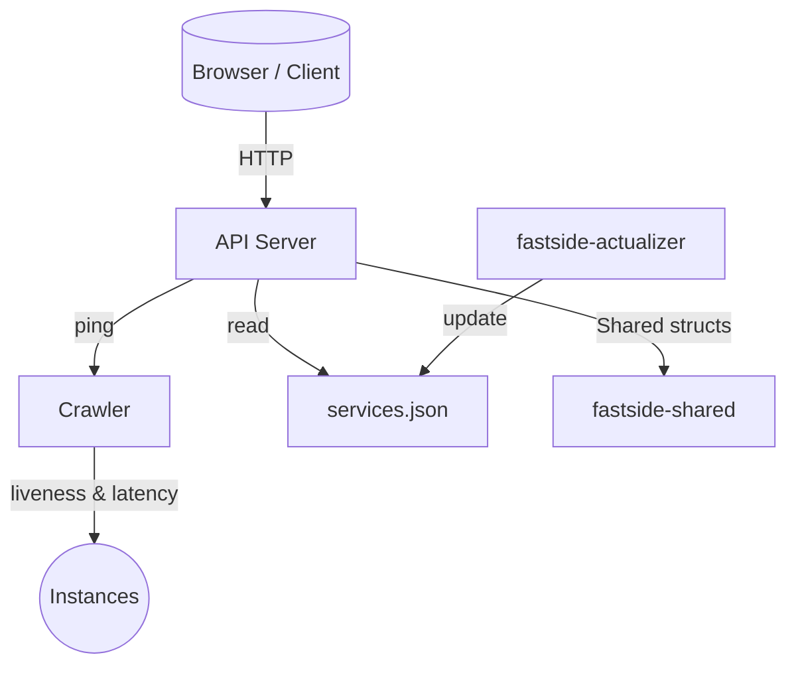

# Architecture

1. **Fastside (API Server)**
   * Exposes HTML frontend, JSON API and transparent redirect endpoints.
   * Uses Actix-web for routing.
   * Delegates instance selection to `search.rs` using live crawl results.

2. **Crawler**
   * Periodically pings every instance to measure availability & RTT.
   * Stores results in memory, shared via `RwLock` with request handlers.
   * Configurable through `crawler` section in `config.yml`.

3. **Fastside-Actualizer**
   * Stand-alone CLI run manually or in CI.
   * Scans origin project pages to discover new instances, prunes dead ones, updates tags.
   * Produces validated `services.json` consumed by the server.

4. **Shared Crate**
   * Houses serde models (`Service`, `Instance`, `UserConfig`…), error types and helpers (HTTP client builder, parallel task runner).

5. **Data flow**
   * `services.json` → loaded at startup → kept in sync by optional auto-reloader.
   * Crawler fills RTT & health → request handlers pick best instance per user prefs.
   * Only actualizer writes to `services.json`, main server only reads it.

6. **Auto-Updater**
   * Optional background task watching file system or remote URL to hot-reload `services.json` without downtime.

For a step-by-step request timeline see `api.md`.
